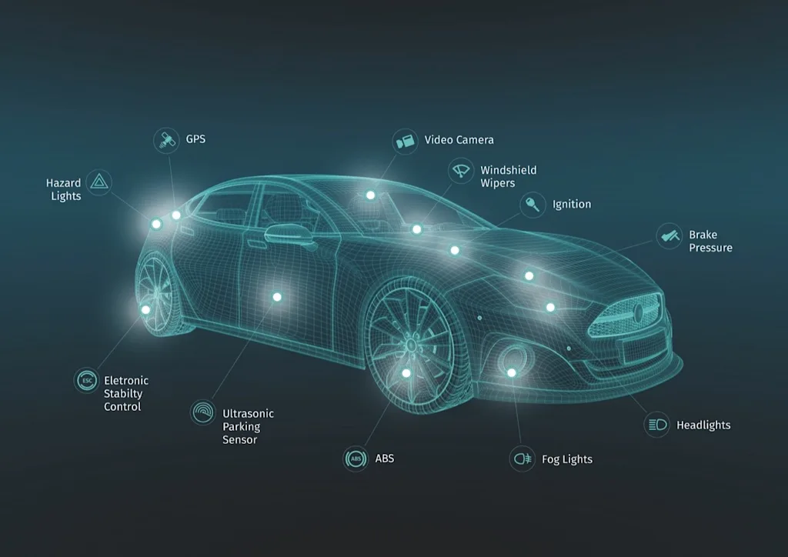

# 🚦 [Sensor Analysis Assignment](./example.ipynb)

---
)

This repository contains my solution for a sensor data analysis task

## 📌 This notebook includes:

- Data exploration and preprocessing
- Feature analysis
- Visualizations and insights
- Clear reasoning behind decisions

---

## 🔍 What I Demonstrated

- Structured analytical thinking
- Data cleaning and preparation
- Insight generation from raw sensor data
- Visualization for decision-making
- Clear documentation of process

